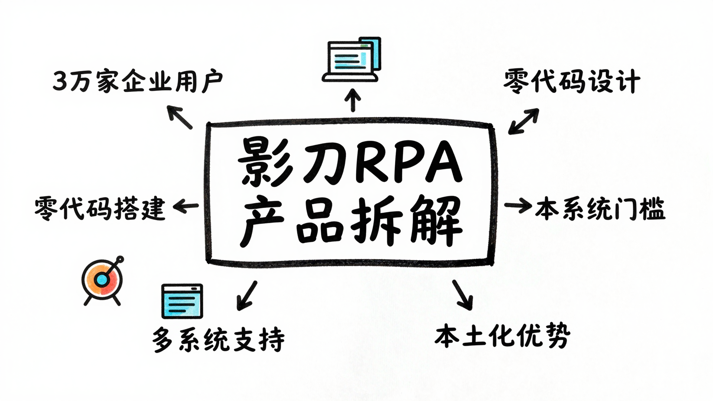

# 影刀RPA：为什么3万家企业选择了它？

---

最近在研究 RPA（机器人流程自动化）工具时，发现了一个有意思的现象。

国内 RPA 市场玩家不少，UiPath、来也、弘玑...但有一款国产工具特别引人注意：影刀RPA。

3万家企业用户，电商领域累计运行超过3亿小时，这些数字背后，它做对了什么？

作为一个产品经理，我今天想从产品设计角度，拆解一下影刀RPA。

---

## 影刀RPA 是什么？

先快速介绍一下。

影刀RPA 是一款国产的机器人流程自动化工具，定位很清晰：**"让软件机器人代替人做重复性工作"**。

核心数据：
- 3万家企业用户
- 电商领域累计运行3亿+小时
- 支持 Windows、Mac、Android 多系统
- 覆盖电商、医疗、金融、制造、零售等行业

它的产品口号我很喜欢："我们创造软件机器人，让人不需要像机器一样工作。"

这句话抓住了 RPA 的本质：**把人从机械重复的工作中解放出来。**

---

## 它解决了什么问题？

从产品角度看，影刀RPA 解决了三个核心痛点：

### 痛点1：企业里大量重复性工作

任何公司都有大量机械重复的工作：
- 电商：批量上架商品、自动回复客户、订单处理
- 财务：发票录入、报表生成、银行对账
- 人事：简历筛选、入职办理、社保申报

这些工作有什么特点？
- 规则明确
- 重复性强
- 容易出错
- 消耗大量人力

影刀RPA 的解决方案是：**用软件机器人模拟人工操作，7×24小时不间断工作。**

### 痛点2：传统RPA门槛太高

传统 RPA 工具（比如 UiPath）虽然强大，但学习曲线陡峭：
- 需要编程基础
- 配置复杂
- 动辄几万到几十万的年费

这导致一个问题：**真正需要 RPA 的业务人员，用不起来。**

影刀RPA 的洞察是：**把 RPA 做成"人人可用"的工具。**

### 痛点3：国外产品本土化不足

UiPath 这类国际大厂，在中国市场有个天然劣势：本土化不够。

比如：
- 界面是英文的
- 文档全是英文
- 对国产软件支持不好
- 价格太贵

影刀RPA 作为国产工具，天然占据本土化优势。

---

## 核心功能拆解

从产品功能设计来看，影刀RPA 做对了三件事：

### 1. 零代码/低代码设计

这是影刀RPA 最聪明的设计决策。

传统的 RPA 需要 Python 或 C# 编程，而影刀采用**积木式拖拽**：

- 不需要写代码
- 可视化流程图
- 拖拽式搭建

这意味着什么？
- 业务人员自己就能搭建机器人
- 不需要依赖 IT 部门
- 从需求到落地，周期从几周缩短到几天

**从产品视角看，这抓住了关键用户场景：真正懂业务的人，往往不会写代码。**

### 2. AI 辅助搭建

影刀RPA 的一个杀手锏功能是：**影刀AI —— 聊天式搭建自动化流程。**

这个设计很有意思：

传统方式：我需要学习 RPA 工具，理解各种组件的含义，然后拖拽搭建。

影刀AI 方式：我直接说"我要自动抓取电商订单数据"，它就帮我生成流程。

这背后是 LLM（大语言模型）的能力：
- 理解自然语言需求
- 自动生成自动化流程
- 降低学习成本

**从产品角度看，这是"降低门槛"的极致体现：连拖拽都不需要，直接对话。**

### 3. 多系统兼容性

影刀RPA 支持三种操作系统：Windows、Mac、Android。

为什么这个很重要？

RPA 的核心是"模拟人工操作"，而不同操作系统的底层接口完全不同。

传统 RPA 工具往往只支持 Windows，但现在的办公场景越来越多元化：
- 用 Mac 做设计的
- 用 Android 手机处理业务的
- 跨设备协作的

影刀RPA 的多系统支持，让一个机器人可以在不同设备上运行，这是一个重要的产品差异化点。

---

## 从影刀RPA学到什么？

作为产品经理，我觉得影刀RPA 有几个设计思路值得借鉴：

### 1. 降低门槛比增加功能更重要

很多产品陷入"功能军备竞赛"，不断堆砌新功能。

但影刀RPA 的核心策略是：**降低使用门槛。**

- 从编程 → 拖拽
- 从拖拽 → 聊天

每一步都在降低门槛，让更多人能用起来。

**我的观点：在 B2B 软件，易用性往往比功能丰富度更重要。**

### 2. 抓住"懂业务但不会技术"的用户

影刀RPA 的目标用户很清晰：业务人员，而不是 IT 专业人士。

为什么？
- 业务人员最懂痛点
- 业务人员最需要自动化
- 但业务人员往往不会写代码

抓住这个用户群，就抓住了真正的需求源头。

### 3. 本土化是国产软件的机会

在国际巨头面前，国产软件的突破口是什么？

影刀RPA 的答案是：**深度本土化。**

- 中文界面
- 针对中国企业的业务场景（比如电商、跨境电商）
- 与国产软件（企业微信、钉钉等）深度集成
- 更有竞争力的价格

**在 B2B 领域，本土化是护城河。**

---

## 我的看法

影刀RPA 不是功能最强大的 RPA 工具，但它可能是最适合中国企业的 RPA 工具之一。

它的核心竞争力，我认为不是技术，而是**产品定位的精准**：

1. 瞄准"业务人员"这个核心用户群
2. 用"零代码 + AI"降低门槛
3. 深度本土化，吃透中国市场

当然，它也有局限性：
- 对于复杂场景，可能不如 UiPath 灵活
- AI 辅助还在早期，准确性有待提升
- 企业级功能（如权限管理、审计日志）可能不如国际大厂

但对于大部分中小企业的自动化需求，影刀RPA 已经够用了。

---

## 总结

拆解完影刀RPA，我的核心观点是：

**好的产品设计，不是比拼功能列表，而是精准定位用户场景，降低使用门槛。**

影刀RPA 做对的事情：
- 找对了用户：业务人员，而非 IT 人员
- 降低门槛：从编程到拖拽到对话
- 深度本土化：针对中国市场优化

如果你也在考虑引入 RPA 工具，我的建议是：

- 如果你是中小企业，业务场景相对简单，影刀RPA 是个不错的选择
- 如果你业务人员多但 IT 资源少，影刀RPA 的零代码特性很适合你
- 如果你需要深度定制、复杂场景，可能需要评估更专业的工具

你对 RPA 工具有什么使用经验？欢迎在评论区聊聊。

---

**我是[你的名字]，一个在 AI 产品路上探索的产品经理。如果觉得有帮助，欢迎关注交流。**
